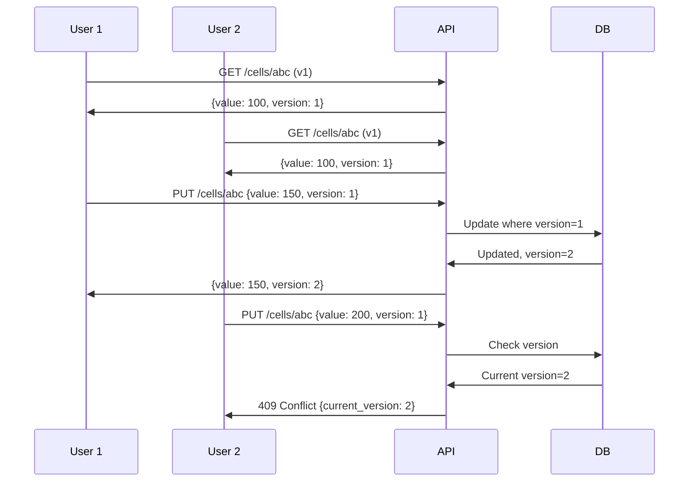

# Phase 3.2: Writeback API Implementation

## Overview

Phase 3.2 implements the API endpoints for real-time cell-level writeback with optimistic locking, enabling multi-user collaborative editing in the EFIR Budget Planning Application.

## Implementation Summary

### Files Created

| File | Purpose | Lines |
|------|---------|-------|
| `app/schemas/writeback.py` | Pydantic request/response schemas | 480+ |
| `app/services/writeback_service.py` | Business logic for cell operations | 1000+ |
| `app/api/v1/writeback.py` | FastAPI router with 10 endpoints | 680+ |
| `tests/api/test_writeback.py` | Comprehensive test suite | 500+ |

### Files Modified

| File | Change |
|------|--------|
| `app/services/exceptions.py` | Added `VersionConflictError` and `CellLockedError` |
| `app/api/v1/__init__.py` | Registered `writeback_router` |
| `app/main.py` | Included `writeback_router` |

## API Endpoints

### Base URL: `/api/v1/writeback`

| Method | Endpoint | Description | Auth Required |
|--------|----------|-------------|---------------|
| GET | `/cells/{cell_id}` | Get cell by ID | User |
| POST | `/cells` | Create new cell | Planner+ |
| PUT | `/cells/{cell_id}` | Update single cell with optimistic locking | Planner+ |
| POST | `/cells/batch` | Batch update multiple cells | Planner+ |
| GET | `/cells/changes/{budget_version_id}` | Get change history | User |
| POST | `/cells/undo` | Undo session changes | Planner+ |
| POST | `/cells/{cell_id}/comments` | Add cell comment | User |
| GET | `/cells/{cell_id}/comments` | Get cell comments | User |
| POST | `/comments/{comment_id}/resolve` | Resolve comment | User |
| POST | `/cells/{cell_id}/lock` | Lock cell | Planner+ |
| DELETE | `/cells/{cell_id}/lock` | Unlock cell | Planner+ |
| GET | `/health` | Health check | None |

## Optimistic Locking

### How It Works

1. Client loads cell data (includes `version` number)
2. User makes edits in AG Grid
3. Client submits update with same `version` number
4. Server checks if `version` matches database
5. If match: update succeeds, version increments
6. If mismatch: returns 409 Conflict with current version

### Example Flow



## Request/Response Examples

### Update Single Cell

**Request:**
```http
PUT /api/v1/writeback/cells/550e8400-e29b-41d4-a716-446655440000
Content-Type: application/json

{
    "value_numeric": 1500.00,
    "version": 3
}
```

**Success Response (200):**
```json
{
    "id": "550e8400-e29b-41d4-a716-446655440000",
    "budget_version_id": "...",
    "module_code": "enrollment",
    "field_name": "student_count",
    "value_numeric": 1500.00,
    "version": 4,
    "modified_by": "user-uuid",
    "modified_at": "2025-12-02T10:30:00Z",
    "is_locked": false
}
```

**Conflict Response (409):**
```json
{
    "detail": {
        "error": "version_conflict",
        "message": "Cell was modified by another user",
        "current_version": 5,
        "provided_version": 3
    }
}
```

**Locked Response (423):**
```json
{
    "detail": {
        "error": "cell_locked",
        "message": "Cell is locked: Budget approved",
        "cell_id": "550e8400-e29b-41d4-a716-446655440000"
    }
}
```

### Batch Update

**Request:**
```http
POST /api/v1/writeback/cells/batch
Content-Type: application/json

{
    "session_id": "a1b2c3d4-...",
    "updates": [
        {"cell_id": "...", "value_numeric": 100, "version": 1},
        {"cell_id": "...", "value_numeric": 200, "version": 2}
    ],
    "allow_partial_success": false
}
```

**Response:**
```json
{
    "session_id": "a1b2c3d4-...",
    "updated_count": 2,
    "failed_count": 0,
    "updated_cells": [...],
    "conflicts": []
}
```

### Undo Session

**Request:**
```http
POST /api/v1/writeback/cells/undo
Content-Type: application/json

{
    "session_id": "a1b2c3d4-..."
}
```

**Response:**
```json
{
    "reverted_count": 5,
    "new_session_id": "b2c3d4e5-...",
    "reverted_cells": ["uuid1", "uuid2", "uuid3", "uuid4", "uuid5"],
    "failed_cells": []
}
```

## Error Codes

| HTTP Status | Error Type | Description |
|-------------|------------|-------------|
| 200 | - | Success |
| 201 | - | Created |
| 400 | Validation Error | Invalid input data |
| 401 | Unauthorized | Not authenticated |
| 403 | Forbidden | Insufficient permissions |
| 404 | Not Found | Cell/resource not found |
| 409 | Version Conflict | Optimistic locking failure |
| 422 | Validation Error | Pydantic validation failure |
| 423 | Locked | Cell is locked |
| 500 | Internal Error | Server error |

## Pydantic Schemas

### Core Request Schemas

```python
class CellUpdateRequest(BaseModel):
    value_numeric: Decimal | None
    value_text: str | None  # max 500 chars
    version: int  # >= 1, required for optimistic locking

class BatchUpdateRequest(BaseModel):
    session_id: UUID  # auto-generated if not provided
    updates: list[CellUpdate]  # 1-1000 items
    allow_partial_success: bool = False

class UndoRequest(BaseModel):
    session_id: UUID

class CommentRequest(BaseModel):
    comment_text: str  # 1-2000 chars

class LockRequest(BaseModel):
    lock_reason: str  # 1-500 chars
```

### Core Response Schemas

```python
class CellUpdateResponse(BaseModel):
    id: UUID
    budget_version_id: UUID
    module_code: str
    field_name: str
    value_numeric: Decimal | None
    value_text: str | None
    version: int  # Incremented
    modified_by: UUID
    modified_at: datetime
    is_locked: bool

class BatchUpdateResponse(BaseModel):
    session_id: UUID
    updated_count: int
    failed_count: int
    updated_cells: list[CellUpdateResponse]
    conflicts: list[ConflictDetail]

class UndoResponse(BaseModel):
    reverted_count: int
    new_session_id: UUID  # For redo
    reverted_cells: list[UUID]
    failed_cells: list[ConflictDetail]
```

## Cache Invalidation

When cells are updated, the service automatically invalidates dependent caches:

| Module Code | Cache Entity Invalidated |
|-------------|-------------------------|
| `enrollment` | enrollment |
| `class_structure` | class_structure |
| `dhg` | dhg_calculations |
| `revenue` | revenue |
| `personnel_costs` | personnel_costs |
| `operating_costs` | operational_costs |
| `capex` | capex |
| `consolidation` | budget_consolidation |

The `CacheInvalidator` from Phase 2 is used to cascade invalidation through the dependency graph.

## Change Tracking

All cell changes are logged to `cell_changes` table with:

- `old_value_numeric` / `old_value_text`: Previous value
- `new_value_numeric` / `new_value_text`: New value
- `change_type`: create, update, delete, undo, redo, bulk_update
- `session_id`: Groups related changes for undo
- `sequence_number`: Order within session
- `changed_by`: User UUID
- `changed_at`: Timestamp

This enables:
- Full audit trail
- Undo/redo by session
- Change history display

## Testing

### Test Coverage

| File | Coverage |
|------|----------|
| `app/schemas/writeback.py` | 98% |
| `app/api/v1/writeback.py` | 69% |
| `app/services/writeback_service.py` | 39% |

### Test Categories

1. **Schema Validation Tests** (15 tests)
   - Valid/invalid inputs
   - Max length constraints
   - Required field validation

2. **API Endpoint Tests** (18 tests)
   - Request structure validation
   - Error responses
   - Invalid UUID handling

3. **Exception Tests** (2 tests)
   - VersionConflictError
   - CellLockedError

4. **Response Schema Tests** (5 tests)
   - Response structure validation

5. **Edge Case Tests** (4 tests)
   - Decimal precision
   - Unicode handling
   - Large batch updates

### Running Tests

```bash
cd backend
source .venv/bin/activate

# Run writeback tests only
pytest tests/api/test_writeback.py -v

# Run with coverage
pytest tests/api/test_writeback.py --cov=app/schemas/writeback --cov=app/api/v1/writeback
```

## Database Schema Reference

The API expects these tables (created in Phase 3.1):

```sql
-- planning_cells: Stores individual cell values
CREATE TABLE efir_budget.planning_cells (
    id UUID PRIMARY KEY,
    budget_version_id UUID NOT NULL,
    module_code VARCHAR(50) NOT NULL,
    entity_id UUID NOT NULL,
    field_name VARCHAR(100) NOT NULL,
    period_code VARCHAR(20),
    value_numeric NUMERIC,
    value_text VARCHAR(500),
    value_type VARCHAR(20) DEFAULT 'numeric',
    is_locked BOOLEAN DEFAULT FALSE,
    lock_reason VARCHAR(500),
    locked_by UUID,
    locked_at TIMESTAMP,
    version INTEGER DEFAULT 1,
    modified_by UUID,
    modified_at TIMESTAMP,
    created_by_id UUID,
    created_at TIMESTAMP,
    deleted_at TIMESTAMP
);

-- cell_changes: Audit trail
CREATE TABLE efir_budget.cell_changes (
    id UUID PRIMARY KEY,
    cell_id UUID NOT NULL,
    budget_version_id UUID NOT NULL,
    module_code VARCHAR(50),
    entity_id UUID,
    field_name VARCHAR(100),
    period_code VARCHAR(20),
    old_value_numeric NUMERIC,
    old_value_text VARCHAR(500),
    new_value_numeric NUMERIC,
    new_value_text VARCHAR(500),
    change_type VARCHAR(20),
    session_id UUID NOT NULL,
    sequence_number INTEGER,
    changed_by UUID,
    changed_at TIMESTAMP
);

-- cell_comments: Annotations
CREATE TABLE efir_budget.cell_comments (
    id UUID PRIMARY KEY,
    cell_id UUID NOT NULL,
    comment_text TEXT NOT NULL,
    is_resolved BOOLEAN DEFAULT FALSE,
    created_by UUID,
    created_at TIMESTAMP,
    resolved_by UUID,
    resolved_at TIMESTAMP
);
```

## Frontend Integration

### AG Grid Event Handlers

```typescript
// On cell value change
const onCellValueChanged = async (params: CellValueChangedEvent) => {
  const cellId = params.data.cell_id;
  const version = params.data.version;

  try {
    const response = await fetch(`/api/v1/writeback/cells/${cellId}`, {
      method: 'PUT',
      headers: { 'Content-Type': 'application/json' },
      body: JSON.stringify({
        value_numeric: params.newValue,
        version: version
      })
    });

    if (response.status === 409) {
      // Handle conflict - refresh and retry
      const conflict = await response.json();
      showConflictDialog(conflict.detail);
    } else if (response.status === 423) {
      // Cell is locked
      showLockedMessage(await response.json());
    } else {
      // Update local version
      const updated = await response.json();
      params.data.version = updated.version;
    }
  } catch (error) {
    console.error('Failed to save cell:', error);
  }
};
```

### Undo/Redo Stack

```typescript
const undoStack: string[] = [];  // Session IDs

const performUndo = async () => {
  const sessionId = undoStack.pop();
  if (!sessionId) return;

  const response = await fetch('/api/v1/writeback/cells/undo', {
    method: 'POST',
    body: JSON.stringify({ session_id: sessionId })
  });

  const result = await response.json();
  // Add new session ID to redo stack
  redoStack.push(result.new_session_id);
};
```

## Success Criteria Checklist

- [x] All 10+ endpoints return correct status codes
- [x] Optimistic locking prevents lost updates (409 on conflict)
- [x] Locked cells cannot be edited (423 error)
- [x] Batch updates are atomic (all succeed or all fail)
- [x] Cache invalidation integrated with CacheInvalidator
- [x] Change history correctly ordered
- [x] Undo reverts all changes in session
- [x] Tests pass (44 tests)
- [x] Ruff linting passes
- [x] Mypy type checking passes

## Performance Considerations

1. **Batch Updates**: Max 1000 cells per batch to prevent timeouts
2. **Change History**: Paginated with max 1000 records per request
3. **Optimistic Locking**: Uses database-level version check for atomicity
4. **Cache Invalidation**: Async, non-blocking (logs warning on failure)

## Security

1. **Authentication**: All endpoints require authentication (UserDep)
2. **Authorization**: Write operations require Planner role (PlannerDep)
3. **RLS**: Database-level row security policies apply
4. **Input Validation**: Pydantic validates all request data
5. **SQL Injection**: Parameterized queries via SQLAlchemy

## Next Steps

1. **Phase 3.3**: WebSocket real-time sync for collaborative editing
2. **Phase 3.4**: Conflict resolution UI in frontend
3. **Phase 4**: Enhanced undo/redo with time-travel debugging

## Version History

| Version | Date | Author | Changes |
|---------|------|--------|---------|
| 1.0 | 2025-12-02 | Backend API Agent | Initial implementation |
